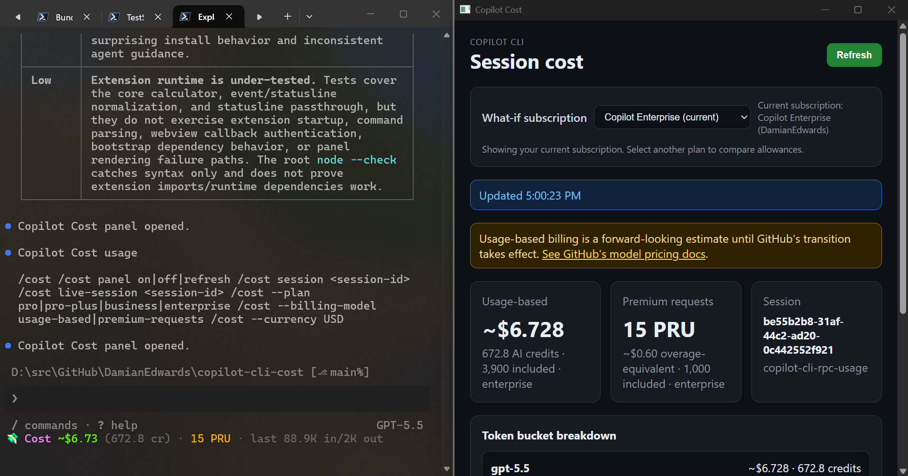

# Copilot CLI Cost

Copilot CLI Cost adds estimated session-cost reporting to GitHub Copilot CLI.

It estimates costs across both Copilot billing models:

- Premium request units
- Usage-based billing with GitHub AI Credits

The calculator stores canonical cost in USD and converts to a selected display currency with cached exchange rates from Frankfurter or an explicit exchange-rate override.



## Features

- `/cost` command for active-session estimates
- `/cost session <session-id>` for completed local sessions
- Native cost panel with token bucket breakdowns
- What-if subscription comparison for Copilot Free, Pro, Pro+, Business, Enterprise, and Student
- Display currency selector backed by cached Frankfurter USD exchange rates
- Statusline cost segment with optional passthrough to another statusline
- Standalone calculator CLI for sample data, JSON files, completed session events, and live snapshots
- USD-first cost model with optional display currency conversion

## Install

### 1. Enable experimental Copilot CLI extensions

The `/cost` command and panel use the experimental Copilot CLI SDK extensions feature. In a Copilot CLI session, run:

```text
/experimental
```

Enable experimental mode and the **Extensions** feature if it is listed, then restart Copilot CLI if prompted.

If your Copilot CLI version does not show an Extensions option in `/experimental`, add the flag manually in `~/.copilot/config.json`:

```jsonc
{
  "experimental": true,
  "experimental_flags": ["EXTENSIONS"]
}
```

If you already have `experimental_flags`, add `"EXTENSIONS"` to the existing list instead of replacing it.

### 2. Install the plugin from GitHub

Run the following in your shell to install the plugin from the GitHub repository:

```shell
copilot plugin install DamianEdwards/copilot-cli-cost
```

Verify that the plugin is installed:

```shell
copilot plugin list
```

### 3. Enable the deterministic `/cost` command and panel

The plugin install puts the package on disk and makes plugin components such as skills available. The `/cost` command and panel are implemented as a Copilot CLI SDK extension, and SDK extensions are discovered from `.github/extensions/` in a repository or from the user extensions folder.

To load the SDK extension from the installed plugin package, use the setup skill from a Copilot CLI session:

```text
Use the copilot-cost-install skill to enable the Copilot Cost /cost command.
```

The skill installs a small user-scoped delegate that imports the SDK extension from the plugin install location.

If you do not want to use the setup skill, paste and run one of these fallback snippets in your terminal after `copilot plugin install` completes. Do not copy these snippets into your repository.

PowerShell terminal:

```powershell
$installer = Get-ChildItem "$env:USERPROFILE\.copilot\installed-plugins" -Directory -Recurse |
  Where-Object { Test-Path (Join-Path $_.FullName "scripts\install-extension-shim.mjs") } |
  Select-Object -First 1 -ExpandProperty FullName

if (-not $installer) {
  throw "Could not find installed copilot-cli-cost plugin."
}

node (Join-Path $installer "scripts\install-extension-shim.mjs")
```

Bash terminal:

```bash
installer="$(find "$HOME/.copilot/installed-plugins" -type f -path '*/scripts/install-extension-shim.mjs' | head -n 1)"
if [ -z "$installer" ]; then
  echo "Could not find installed copilot-cli-cost plugin." >&2
  exit 1
fi
node "$installer"
```

In Copilot CLI, run:

```text
/extensions
```

Enable `copilot-cli-cost` under **User**. The `/cost` command and panel are available after the extension is running.

## Use

```text
/cost
/cost help
/cost panel on
/cost panel off
/cost panel refresh
/cost session <session-id>
/cost live-session <session-id>
/cost --plan pro|pro-plus|business|enterprise
/cost --billing-model usage-based|premium-requests
/cost --currency USD|EUR|GBP|CAD|AUD|JPY|CHF
```

`/cost` is handled by extension JavaScript. It does not ask the model to calculate the result.

The panel opens a native window:

```text
/cost panel on
```

The panel shows:

- Usage-based estimate
- Premium-request estimate
- Active session ID and data source
- Current or assumed subscription
- What-if subscription selector
- Display currency selector
- Per-model token bucket breakdown
- Collapsed raw JSON payload

## Data sources

The SDK extension reads active-session metrics from Copilot CLI's session RPC API:

```js
await session.rpc.usage.getMetrics()
```

That response includes:

- Per-model request counts
- Premium request cost
- Input, cached input, cache write, output, and reasoning token buckets
- Active model
- Last-call input/output token counts
- API duration
- Code-change counters

The extension normalizes each read and writes a live snapshot to:

```text
%LOCALAPPDATA%\copilot-cli-cost\live-sessions
```

Completed local sessions can be read from:

```text
%USERPROFILE%\.copilot\session-state\<session-id>\events.jsonl
```

The parser reads the latest metrics event and extracts per-model token buckets plus total premium request units.

## Statusline

Copilot CLI can invoke a statusline command with a JSON payload on stdin. Configure this statusline bridge in `~/.copilot/config.json`:

```jsonc
{
  "experimental": true,
  "experimental_flags": ["STATUS_LINE"],
  "statusLine": {
    "type": "command",
    "command": "%USERPROFILE%\\.copilot\\installed-plugins\\...\\copilot-cli-cost\\scripts\\statusline.cmd"
  }
}
```

Replace the command path with the installed plugin path on your machine. The statusline bridge prints a compact segment:

```text
💸 Cost ~$0.7742 (77.4 cr) · 7.5 PRU · last 42K in/3K out
```

### Use another statusline

Set `COPILOT_COST_STATUSLINE_PASSTHROUGH` to call another statusline command. The default passthrough mode enriches the stdin JSON with `copilot_cost` and lets the inner statusline render all output.

```powershell
$env:COPILOT_COST_STATUSLINE_PASSTHROUGH = "C:\Users\alex\.copilot\statusline\statusline.cmd"
copilot
```

The enriched payload includes:

```jsonc
{
  "copilot_cost": {
    "schema_version": 1,
    "status_line": "💸 Cost ~$0.7742 (77.4 cr) · 7.5 PRU · last 42K in/3K out",
    "usage_based": {
      "billingModel": "usage-based",
      "totalUsd": 0.774159,
      "aiCredits": 77.4159
    },
    "premium_requests": {
      "billingModel": "premium-requests",
      "totalPremiumRequests": 7.5,
      "overageEquivalentUsd": 0.3
    }
  }
}
```

Set decorate mode to combine this bridge's output with the passthrough output:

```powershell
$env:COPILOT_COST_STATUSLINE_MODE = "decorate"
$env:COPILOT_COST_STATUSLINE_POSITION = "right"
copilot
```

Statusline environment variables:

| Variable | Default | Meaning |
| --- | --- | --- |
| `COPILOT_COST_STATUSLINE_PASSTHROUGH` | unset | Command to invoke with enriched statusline JSON on stdin. |
| `COPILOT_COST_STATUSLINE_MODE` | `passthrough` when passthrough is set, otherwise `standalone` | `passthrough`, `decorate`, or `standalone`. |
| `COPILOT_COST_STATUSLINE_POSITION` | `right` | In `decorate` mode: `right`, `left`, `replace`, or `passthrough`. |
| `COPILOT_COST_STATUSLINE_SEPARATOR` | ` · ` | In `decorate` mode: text between the passthrough output and cost segment. |
| `COPILOT_COST_STATUSLINE_PASSTHROUGH_TIMEOUT_MS` | `1000` | Maximum time to wait for the passthrough command. |
| `COPILOT_COST_STATUSLINE_HIDE_COST` | `false` | Cache live data but do not print the cost segment. |
| `COPILOT_COST_STATUSLINE_COLOR` | `true` | Set to `false` to disable ANSI color in the rendered cost segment. |

## Configuration

Set these environment variables before launching `copilot`:

```powershell
$env:COPILOT_COST_PLAN = "enterprise"
$env:COPILOT_COST_CURRENCY = "EUR"
$env:COPILOT_COST_PROMOTIONAL_ALLOWANCE = "true"
copilot
```

| Variable | Meaning |
| --- | --- |
| `COPILOT_COST_PLAN` | Default plan when subscription detection is unavailable. |
| `COPILOT_COST_CURRENCY` | Display currency code. USD is canonical. Non-USD values use Frankfurter unless an override is configured. |
| `COPILOT_COST_EXCHANGE_RATE` | USD-to-display-currency exchange rate override for `COPILOT_COST_CURRENCY`. |
| `COPILOT_COST_FX_<CODE>` | USD-to-currency exchange rate override for a specific currency, for example `COPILOT_COST_FX_EUR=0.9`. |
| `COPILOT_COST_FX_CACHE` | Exchange-rate cache folder. Defaults to `%LOCALAPPDATA%\copilot-cli-cost\fx-rates`. |
| `COPILOT_COST_PROMOTIONAL_ALLOWANCE` | Use promotional Business/Enterprise AI Credit allowances. |
| `COPILOT_COST_BILL_REASONING_TOKENS` | Set to `false` to exclude reasoning tokens from usage-based estimates. |

## Standalone calculator

Clone the repository when you want to run tests or use the calculator directly:

```powershell
git clone https://github.com/DamianEdwards/copilot-cli-cost.git
cd copilot-cli-cost
npm test
```

Examples:

```powershell
npm run cost -- --sample
npm run cost -- --sample --billing-model premium-requests --plan pro-plus
npm run cost -- --premium-requests 12.5 --plan pro --remaining-premium-requests 10
npm run cost -- --session <session-id> --plan pro
npm run cost -- --live --plan enterprise
npm run cost -- --sample --currency EUR
npm run cost -- --sample --currency EUR --exchange-rate 0.9
```

Usage JSON shape:

```json
{
  "sessionId": "sample-session-001",
  "plan": "pro",
  "currency": "USD",
  "modelUsage": [
    {
      "model": "gpt-5.5",
      "requests": 3,
      "inputTokens": 180000,
      "cachedInputTokens": 420000,
      "cacheWriteTokens": 0,
      "outputTokens": 36000,
      "reasoningTokens": 1200
    }
  ]
}
```

## How estimates are calculated

Usage-based billing uses published per-1M-token rates:

```text
inputUsd       = inputTokens       / 1,000,000 * inputPerMillionUsd
cachedInputUsd = cachedInputTokens / 1,000,000 * cachedInputPerMillionUsd
cacheWriteUsd  = cacheWriteTokens  / 1,000,000 * cacheWritePerMillionUsd
outputUsd      = outputTokens      / 1,000,000 * outputPerMillionUsd
reasoningUsd   = reasoningTokens   / 1,000,000 * outputPerMillionUsd
aiCredits      = totalUsd / 0.01
```

Premium-request billing uses Copilot-reported premium request units when present. If only model request counts are available, it applies the configured model multiplier table.

Non-USD currency values are display estimates. USD remains canonical because GitHub model rates and AI Credits are documented in USD. Non-USD `/cost` and panel requests fetch USD exchange rates from [Frankfurter](https://www.frankfurter.dev/) and cache them for reuse; explicit environment or CLI exchange-rate overrides take precedence.

## Limitations

- Rate tables are hardcoded in `src/core/rates.js` and should be checked against GitHub billing docs.
- Reasoning tokens are treated as output-priced unless `COPILOT_COST_BILL_REASONING_TOKENS=false`.
- Business and Enterprise included credits are pooled at the billing entity level, so a session estimate is not always incremental billable spend.
- Taxes, regional billing rules, and GitHub billing-account currency handling are not modeled.
- Statusline per-model attribution depends on successive cumulative payloads and the active model at each refresh.

## License

MIT. See [LICENSE](LICENSE).
